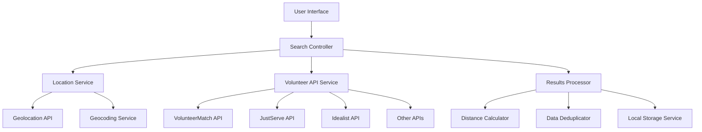

# Design Document

## Overview

This design document outlines the architecture and implementation approach for building a volunteer match website called VolunteerManiac which helps people connect with their community and achieve their volunteering goals. The scope and requirements are there should be a search box for people to input the city and country where they live and a "search" button for them to click search and find volunteer opportunities in the area. There should be different filters for volunteer opportunities based on causes - human rights, animals, arts & cultures, children & youth, Technology, Education, Health & medicine, Disaster Assistance, Employment, Environment, Homelessness, Hunger, etc. The filter should also have options for in person or virtual volunteer opportunities. The solution will integrate multiple volunteer opportunity APIs, implement geolocation services, and provide enhanced location-based search capabilities.

## Architecture

### High-Level Architecture



### Data Flow

1. **User Input**: User enters location or uses geolocation
2. **Location Processing**: Convert location to coordinates and standardized format
3. **API Orchestration**: Query multiple volunteer opportunity APIs in parallel
4. **Data Processing**: Merge, deduplicate, and enrich results with distance calculations
5. **Display**: Present sorted and filtered results to the user

## Components and Interfaces

### 1. Location Service

**Purpose**: Handle all location-related functionality including geolocation, geocoding, and location autocomplete.

**Interface**:
```typescript
interface LocationService {
  getCurrentLocation(): Promise<GeolocationResult>;
  geocodeLocation(address: string): Promise<Coordinates>;
  reverseGeocode(coordinates: Coordinates): Promise<LocationInfo>;
  getLocationSuggestions(query: string): Promise<LocationSuggestion[]>;
  calculateDistance(from: Coordinates, to: Coordinates): number;
}

interface GeolocationResult {
  coordinates: Coordinates;
  address: LocationInfo;
  accuracy: number;
}

interface Coordinates {
  latitude: number;
  longitude: number;
}

interface LocationInfo {
  city: string;
  state?: string;
  country: string;
  formattedAddress: string;
}

interface LocationSuggestion {
  displayName: string;
  coordinates: Coordinates;
  details: LocationInfo;
}
```

**Implementation Details**:
- Use browser Geolocation API for current location
- Integrate with OpenStreetMap Nominatim API for geocoding (free alternative to Google Maps)
- Implement Haversine formula for distance calculations
- Cache geocoding results to reduce API calls

### 2. Volunteer API Service

**Purpose**: Orchestrate searches across multiple volunteer opportunity APIs and normalize the data.

**Interface**:
```typescript
interface VolunteerAPIService {
  searchOpportunities(searchParams: SearchParameters): Promise<VolunteerOpportunity[]>;
  getOpportunityDetails(id: string, source: string): Promise<VolunteerOpportunity>;
}

interface SearchParameters {
  location: Coordinates;
  radius: number; // in miles
  keywords?: string;
  causes?: string[];
  type?: 'in-person' | 'virtual' | 'both';
  limit?: number;
}

interface VolunteerOpportunity {
  id: string;
  source: string; // API source identifier
  title: string;
  organization: string;
  description: string;
  location: LocationInfo;
  coordinates?: Coordinates;
  type: 'in-person' | 'virtual';
  cause: string;
  skills: string[];
  timeCommitment: string;
  date: string;
  participants?: number;
  contactInfo: ContactInfo;
  externalUrl: string;
  distance?: number; // calculated distance from search location
}

interface ContactInfo {
  email?: string;
  phone?: string;
  website?: string;
}
```

**API Integration Strategy**:

1. **Primary APIs to Integrate**:
   - **VolunteerHub API**: Comprehensive volunteer opportunity database
   - **JustServe.org**: Community service opportunities
   - **Idealist.org API**: Social impact opportunities
   - **United Way API**: Local community opportunities
   - **Points of Light API**: Volunteer matching service

2. **Fallback/Alternative Sources**:
   - Web scraping of major volunteer websites (as backup)
   - RSS feeds from volunteer organizations
   - Local government volunteer portals

3. **API Adapter Pattern**:
   Each API will have its own adapter to normalize data into the common `VolunteerOpportunity` interface.

### 3. Search Controller

**Purpose**: Coordinate the search process, manage state, and handle user interactions.

**Interface**:
```typescript
interface SearchController {
  performSearch(query: SearchQuery): Promise<SearchResult>;
  updateFilters(filters: SearchFilters): void;
  saveSearchPreferences(preferences: SearchPreferences): void;
  loadSearchPreferences(): SearchPreferences;
}

interface SearchQuery {
  location: string;
  useCurrentLocation: boolean;
  radius: number;
  filters: SearchFilters;
}

interface SearchFilters {
  causes: string[];
  type: 'in-person' | 'virtual' | 'both';
  timeCommitment?: string;
  skills?: string[];
}

interface SearchResult {
  opportunities: VolunteerOpportunity[];
  searchLocation: LocationInfo;
  totalResults: number;
  sources: string[];
  errors?: APIError[];
}

interface SearchPreferences {
  lastLocation: LocationInfo;
  preferredRadius: number;
  preferredCauses: string[];
  preferredType: 'in-person' | 'virtual' | 'both';
}
```

### 4. Results Processor

**Purpose**: Process, deduplicate, and enrich search results from multiple APIs.

**Interface**:
```typescript
interface ResultsProcessor {
  processResults(
    results: APIResult[], 
    searchLocation: Coordinates
  ): Promise<VolunteerOpportunity[]>;
  deduplicateOpportunities(opportunities: VolunteerOpportunity[]): VolunteerOpportunity[];
  calculateDistances(
    opportunities: VolunteerOpportunity[], 
    searchLocation: Coordinates
  ): VolunteerOpportunity[];
  sortByDistance(opportunities: VolunteerOpportunity[]): VolunteerOpportunity[];
}

interface APIResult {
  source: string;
  opportunities: VolunteerOpportunity[];
  success: boolean;
  error?: string;
}
```

## Data Models

### Enhanced VolunteerOpportunity Model

The existing `VolunteerOpportunity` interface will be extended to support internet-sourced data:

```typescript
interface VolunteerOpportunity {
  // Existing fields
  id: string;
  title: string;
  organization: string;
  location: string;
  city: string;
  country: string;
  type: 'in-person' | 'virtual';
  cause: string;
  description: string;
  timeCommitment: string;
  skills: string[];
  image: string;
  date: string;
  participants: number;
  
  // New fields for internet integration
  source: string; // API source
  coordinates?: Coordinates;
  distance?: number; // miles from search location
  contactInfo: ContactInfo;
  externalUrl: string;
  lastUpdated: Date;
  verified: boolean; // indicates if opportunity is verified by source
  applicationDeadline?: Date;
  requirements?: string[];
}
```

### Search State Management

```typescript
interface SearchState {
  isLoading: boolean;
  searchLocation: LocationInfo | null;
  currentLocation: GeolocationResult | null;
  searchRadius: number;
  filters: SearchFilters;
  results: VolunteerOpportunity[];
  totalResults: number;
  activeSources: string[];
  errors: APIError[];
  lastSearchTime: Date;
}
```

## Error Handling

### Error Types and Handling Strategy

1. **Geolocation Errors**:
   - Permission denied: Show manual location input
   - Position unavailable: Fall back to IP-based location detection
   - Timeout: Provide manual location entry option

2. **API Errors**:
   - Network failures: Retry with exponential backoff
   - Rate limiting: Queue requests and respect rate limits
   - API unavailable: Continue with available sources, show warning

3. **Data Processing Errors**:
   - Invalid coordinates: Skip opportunity or use approximate location
   - Missing required fields: Use default values or exclude from results
   - Geocoding failures: Show opportunities without distance calculation

### Error Recovery Mechanisms

```typescript
interface ErrorHandler {
  handleGeolocationError(error: GeolocationPositionError): void;
  handleAPIError(source: string, error: APIError): void;
  handleNetworkError(error: NetworkError): void;
  retryFailedRequests(): Promise<void>;
}

interface APIError {
  source: string;
  type: 'network' | 'rate_limit' | 'authentication' | 'server_error';
  message: string;
  retryable: boolean;
  retryAfter?: number;
}
```

## Testing Strategy

### Unit Testing

1. **Location Service Tests**:
   - Geolocation permission handling
   - Geocoding API integration
   - Distance calculation accuracy
   - Location suggestion filtering

2. **API Service Tests**:
   - Mock API responses for each integrated service
   - Error handling for various failure scenarios
   - Data normalization accuracy
   - Rate limiting compliance

3. **Results Processing Tests**:
   - Deduplication algorithm effectiveness
   - Distance calculation accuracy
   - Sorting and filtering logic

### Integration Testing

1. **End-to-End Search Flow**:
   - Complete search from location input to results display
   - Multi-location search functionality
   - Filter application and result updates

2. **API Integration Tests**:
   - Real API calls with test data
   - Error handling with actual API failures
   - Performance under various network conditions

### Performance Testing

1. **Load Testing**:
   - Multiple concurrent API requests
   - Large result set processing
   - Memory usage with extensive search results

2. **Network Testing**:
   - Slow network conditions
   - Intermittent connectivity
   - API response time variations

## Security Considerations

### API Key Management

- Store API keys in environment variables
- Implement key rotation strategy
- Use different keys for development/production
- Monitor API usage and implement alerts

### Data Privacy

- Minimize location data storage
- Implement user consent for geolocation
- Clear location data on user request
- Comply with privacy regulations (GDPR, CCPA)

### Rate Limiting and Abuse Prevention

- Implement client-side rate limiting
- Cache results to reduce API calls
- Implement request throttling
- Monitor for unusual usage patterns

## Performance Optimization

### Caching Strategy

1. **Location Data Caching**:
   - Cache geocoding results for 24 hours
   - Store location suggestions for quick access
   - Cache user's preferred locations

2. **Search Results Caching**:
   - Cache search results for 30 minutes
   - Implement cache invalidation for real-time updates
   - Use browser storage for offline access

3. **API Response Caching**:
   - Cache API responses based on location and filters
   - Implement cache warming for popular locations
   - Use CDN for static content

### Optimization Techniques

1. **Parallel API Requests**:
   - Query multiple APIs simultaneously
   - Implement timeout handling for slow APIs
   - Progressive result loading

2. **Lazy Loading**:
   - Load additional results on scroll
   - Defer loading of non-critical data
   - Implement virtual scrolling for large result sets

3. **Data Compression**:
   - Compress API responses
   - Minimize data transfer
   - Use efficient data structures